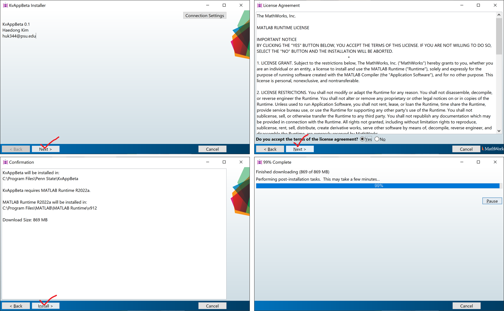
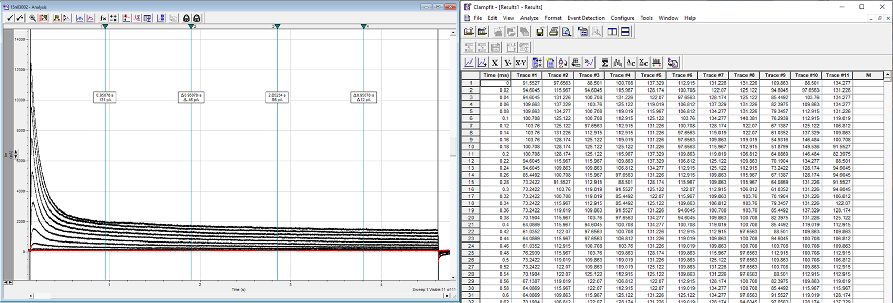
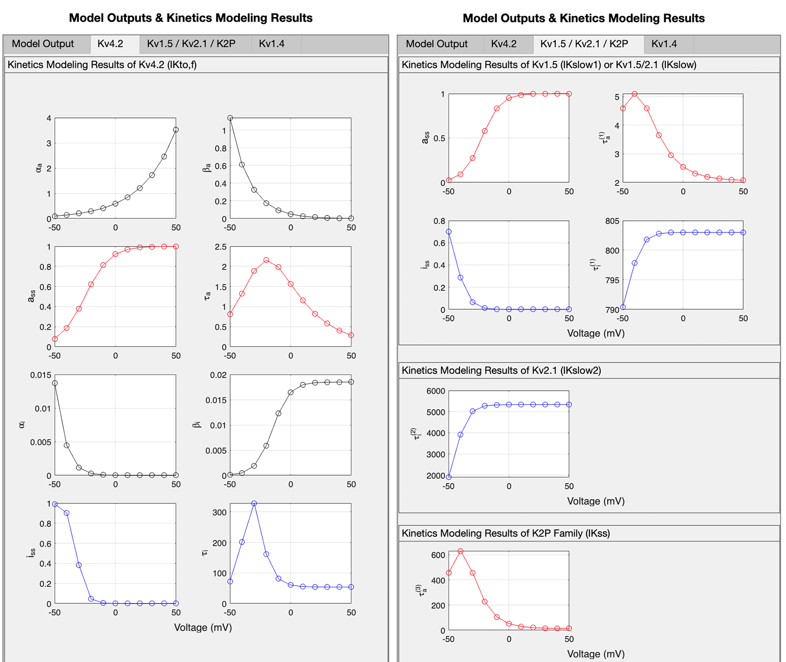
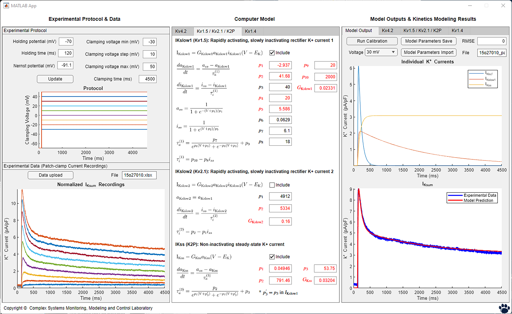

```{r setup, include=FALSE}
knitr::opts_chunk$set(echo = TRUE)
```

## Introduction

This manual describes the installation and use of a novel tool for analyzing whole-cell K^+^ current traces (I~K~). Cardiac voltage-gated K^+^ channels (K~v~) are responsible for repolarizing the action potential propagating thorugh cardiomyocytes. K~v~ are indispensable in the electrical conduction system of the heart, and even modest changes lead to fatal heart failures and diseases, such as long QT syndrome. Whole-cell patch-clamp recordings of K^+^ currents have been critical methods for studying the effects of disease-related alteration in activities of K~v~. These *in-vitro* experiments alone are not enough to determine the component currents of I~K~ recordings generated from various K~v~ isofroms and underlying gating mechanism. Typically, curve fitting is used to analyze I~K~ traces. However, this traditional approach is limited in its ability to estimate channel kinetics rigorously in two aspects. 1) It applies multiple curve fittings to the channel-gating processes that work together. 2) This approach is only applicable to a single I~K~ recording at each time. Hence, methods based on curve fitting do not consider complex relationships of channel-gating processes and cellular-level dynamics of multiple responses (i.e., I~K~ recordings) measured in a cell. This software implements a novel concurrent assimilation method of multi-response data for modeling and calibrating K~v~ kinetics in mouse cardiomyocytes. 

## Getting Started

`MyAppInstaller_web` will install the packaged application and MATLAB Runtime from the Internet, *which enables the application to run without having MATLAB installed.* Your computer needs to be connected to the Internet to complete the installation. If the Internet connection is not available, `MyAppInstaller_mcr` will install the necessary programs locally. A few screenshots below in Figure 1 show the installation process. `KvAppBeta` is the execution file that runs the application. Another file `splash` is just an image file for the application icon.



## Importing Experimental Data

The application consists of three modules, as shown in Figure 2: Experimental Protocol & Data, Computer Model, and Model Outputs & Kinetics Modeling Results. The data to be investigated *in silico* should be stored in an Excel file, with the first column corresponding to time and the other columns normalized currents for voltage steps in increasing order. This is a default format when I~Ksum~ traces are transferred to a tabular format in ClampFit. Figure 3 is an example of I~Ksum~ recordings. To import a dataset, we need to specify the experimental protocol of the voltage-clamp method used to generate that dataset. If the defined protocol does not match the data, it will give an error or does not display the data correctly. 




## Model Calibration and Results



The Computer Model module shows equations and kinetics parameters of computers models of K~v~ isoforms separated by tabs. The Computer Model module shows equations and kinetics parameters of computers models of potassium isoforms, separated and grouped by tabs. The K~v~4.2 model in the first tab is the only stand-alone model in which every kinetic variables and parameter are independent of other models. The second tab contains three closely connected models. Each model can be chosen to be or not be included in calculating the total potassium current by checking or unchecking the Include boxes. The kinetic parameters can be adjusted manually by entering the number in the corresponding box and pressing the enter/return key. Parameters in red are identified as having significant impacts on the model behavior.

These parameters in red can be calibrated automatically using the Turn Calibration button in the Model Output tab of the third module. This function calibrates the models by minimizing discrepancies between model prediction and experimental I~K~ traces. The fitness of calibration results is visualized, and the drop-down button allows to select different voltage steps. The calibrated parameter values can be saved using the Model Parameters Save button in an Excel file. It is desirable to perform model calibration separately, utilizing more computing power and time for better results. Other tabs named after the K~v~ isoforms show kinetic variables such as steady states, time constants, and transition rates as shown on Figure 4.

\newpage

## Example

This section provides an example of using the application. A data set will be used having voltage steps from -30 to 50 mV lasting 4.5 s from holding voltage -70 mV. The data is saved in the provided file, `15o27010.xlsx`. First update the protocol accordingly and upload the data as in Figure 5. Change the protocol of the smallest clamp voltage from -50 to -30 mV, and exclude I~Kslow2~. Discrepancies between the model prediction and experimental I~K~ traces can be observed in the bottom right figure. To calibrate the models according to the data, click the Run Calibration button. It will change to a progress bar as in Figure 6. Once the calibration is completed, the model outputs and kinetics are updated as in Figure 7.



